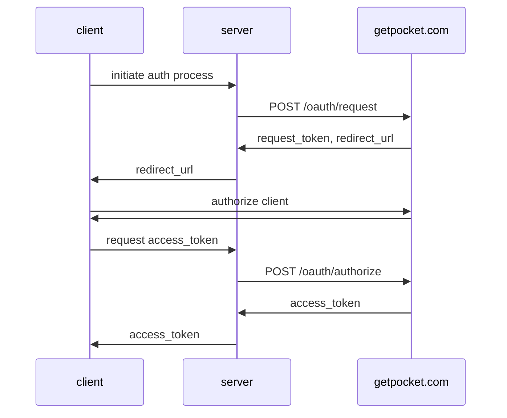

# pockety

An async API client for getpocket.com with an interface loosely inspired by octocrab.

## Auth flow

```mermaid
sequenceDiagram
	client->>server: initiate auth process
	server->>getpocket.com: POST /oauth/request
	getpocket.com->>server: request_token, redirect_url
  server->>client: redirect_url
  client->>getpocket.com: authorize client
  getpocket.com->>client: 
  client->>server: request access_token
  server->>getpocket.com: POST /oauth/authorize
  getpocket.com->>server: access_token
  server->>client: access_token
```

## Examples

Examples are in the [examples](./examples/) directory.

## License

MIT
