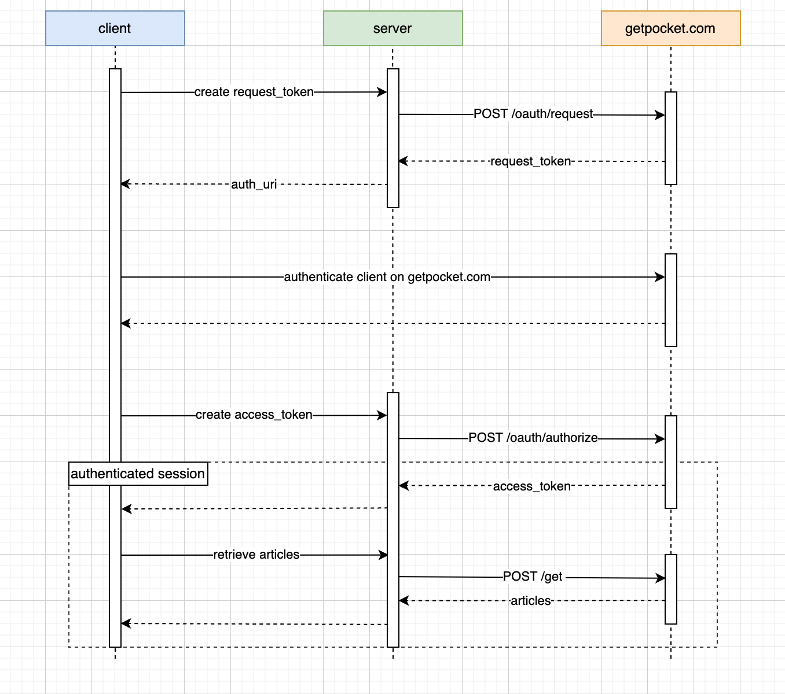

# pockety

An async API client for getpocket.com with an interface loosely inspired by octocrab.

## Auth flow

getpocket.com's authentication flow can get confusing, especially when they only
have written documentation. However, once represented in a diagram, things start
to look much simpler.

## Examples

Examples are in the [examples](./examples/) directory.

## License

MIT